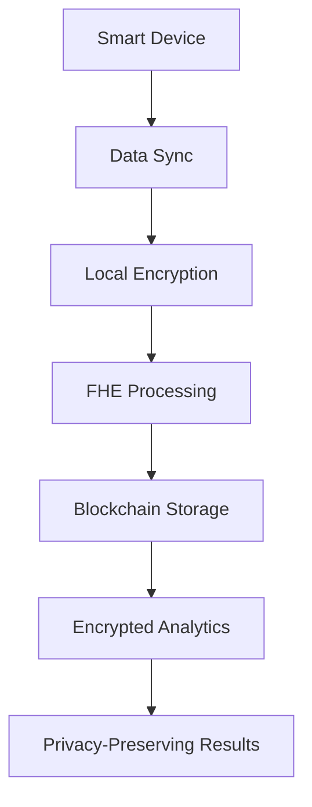

# Health Vault 🔐

A confidential health data sharing platform built with **ZAMA FHE (Fully Homomorphic Encryption)** technology, enabling secure storage and computation on encrypted health data while maintaining complete privacy.


## 🌟 Features

### 🔒 **Privacy-First Architecture**
- **FHE Encryption**: All health data is encrypted using ZAMA's Fully Homomorphic Encryption
- **Zero-Knowledge Storage**: Data remains encrypted even during computation
- **Privacy-Preserving Analytics**: Perform calculations on encrypted data without decryption

### 📱 **Smart Device Integration**
- **Wearable Device Sync**: Connect and sync data from smartwatches, fitness trackers
- **Health App Integration**: Import data from Apple Health, Google Fit, and other platforms
- **Batch Data Processing**: Efficiently handle large volumes of health data

### ⛏️ **Health Data Mining**
- **On-Chain Rewards**: Earn points for contributing health data
- **Quality Scoring**: Data quality assessment and bonus rewards
- **Leaderboard System**: Compete with other users in health data contribution

### 🏥 **Medical-Grade Security**
- **End-to-End Encryption**: Data encrypted locally before blockchain storage
- **Access Control**: Granular permissions for data sharing
- **Audit Trail**: Complete transaction history and data lineage

## 🚀 Quick Start

### Prerequisites

- Node.js 18+ 
- npm or yarn
- Git

### Installation

1. **Clone the repository**
   ```bash
   git clone https://github.com/Franwwenkie/health-vault.git
   cd health-vault
   ```

2. **Install dependencies**
   ```bash
   npm install
   ```

3. **Set up environment variables**
   ```bash
   cp env.example .env.local
   ```
   
   Update `.env.local` with your configuration:
   ```env
   NEXT_PUBLIC_HEALTH_VAULT_ADDRESS=0x07BF9B17e1eb2bAA4b374F01DE7f9e58caF00879
   NEXT_PUBLIC_CHAIN_ID=11155111
   NEXT_PUBLIC_NETWORK=sepolia
   NEXT_PUBLIC_WALLET_CONNECT_PROJECT_ID=your_project_id
   FHEVM_NETWORK=sepolia
   ```

4. **Start the development server**
   ```bash
   npm run dev
   ```

5. **Open your browser**
   Navigate to [http://localhost:3000](http://localhost:3000)

## 🏗️ Architecture

### Smart Contract Layer
- **HealthVault.sol**: Core contract with FHE integration
- **Mining System**: Points, streaks, and leaderboard functionality
- **Data Sharing**: Permission-based access control

### Frontend Layer
- **Next.js 14**: Modern React framework with App Router
- **Wagmi v2**: Ethereum interaction library
- **RainbowKit**: Wallet connection interface
- **Tailwind CSS**: Utility-first styling

### FHE Integration
- **ZAMA FHEVM**: Fully Homomorphic Encryption for Solidity
- **Encrypted Data Types**: `euint32`, `externalEuint32`, `ebool`
- **Homomorphic Operations**: Secure computation on encrypted data

## 📊 Data Flow



## 🔧 Development

### Smart Contract Development

1. **Compile contracts**
   ```bash
   npx hardhat compile
   ```

2. **Run tests**
   ```bash
   npx hardhat test
   ```

3. **Deploy to Sepolia**
   ```bash
   npx hardhat run scripts/deploy-sepolia.js --network sepolia
   ```

### Frontend Development

1. **Start development server**
   ```bash
   npm run dev
   ```

2. **Build for production**
   ```bash
   npm run build
   ```

3. **Start production server**
   ```bash
   npm start
   ```

## 📱 User Journey

### 1. **Connect Devices** 🔗
- Link your smartwatch, fitness tracker, or health app
- Authorize data synchronization
- View real-time sync status

### 2. **Data Dashboard** 📊
- Review synced health data
- Monitor data quality and completeness
- Access encrypted analytics

### 3. **Upload to Blockchain** ⛓️
- Encrypt data using FHE technology
- Upload to Health Vault contract
- Earn mining rewards and points

### 4. **Health Mining** ⛏️
- Track your contribution points
- Maintain mining streaks
- Compete on the leaderboard

## 🛡️ Security Features

### Encryption
- **FHE Encryption**: Data encrypted with ZAMA FHE technology
- **Local Processing**: Encryption happens in your browser
- **Zero-Knowledge**: No plaintext data ever leaves your device

### Access Control
- **Permission System**: Granular control over data sharing
- **Owner-Only Access**: Only you can decrypt your data
- **Audit Logging**: Complete transaction history

### Privacy
- **No Data Leakage**: Encrypted data cannot be read by anyone
- **Computation Privacy**: Calculations performed on encrypted data
- **Decentralized Storage**: No central authority controls your data

## 🌐 Network Support

- **Sepolia Testnet**: Primary development and testing network
- **FHEVM Compatible**: Full support for homomorphic encryption
- **Ethereum Compatible**: Standard EVM operations

## 📚 Documentation

- [API Reference](./API_REFERENCE.md) - Complete API documentation
- [Deployment Guide](./DEPLOYMENT_GUIDE.md) - Step-by-step deployment instructions
- [Smart Contract Docs](./contracts/) - Solidity contract documentation

## 🤝 Contributing

We welcome contributions! Please see our [Contributing Guidelines](CONTRIBUTING.md) for details.

### Development Setup
1. Fork the repository
2. Create a feature branch
3. Make your changes
4. Add tests if applicable
5. Submit a pull request

## 📄 License

This project is licensed under the MIT License - see the [LICENSE](LICENSE) file for details.

## 🙏 Acknowledgments

- **ZAMA**: For providing the FHE technology and FHEVM
- **FHEVM Community**: For excellent documentation and support
- **Ethereum Foundation**: For the robust blockchain infrastructure

## 🔗 Links

- **Live Demo**: [Coming Soon]
- **Documentation**: [API Reference](./API_REFERENCE.md)
- **Smart Contract**: [Etherscan](https://sepolia.etherscan.io/address/0x07BF9B17e1eb2bAA4b374F01DE7f9e58caF00879)
- **Issues**: [GitHub Issues](https://github.com/Franwwenkie/health-vault/issues)

## 📞 Support

- **Discord**: [Join our community]
- **Email**: [support@healthvault.dev]
- **Twitter**: [@HealthVaultFHE]

---

**Built with ❤️ using ZAMA FHE Technology**

*Empowering privacy-preserving health data management on the blockchain*